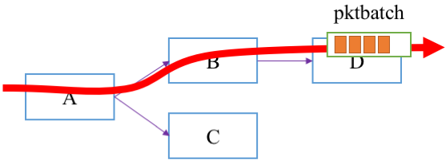
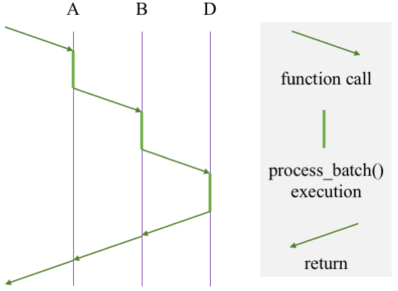
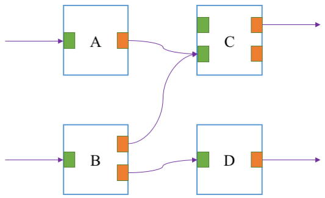

## Module details

Module is the basic building block in BESS. Each module performs some particular task on packets (e.g., remove VLAN tag from packet header). Operators or external controllers specify what kind of modules to use, how many of them, and how to interconnect them in the **datapath pipeline**. In other words, the behavior of BESS will depend on how modules are composed and configured in the pipeline.

If there is no module that exactly meets your needs, you will need to implement your own module. For more information on how to actually implement a custom module, also refer to [this page](writing_modules.md). This page only discusses the internal design of BESS modules, not implementation details.


### Module class vs. module instance

For further discussion, it is helpful to understand the concept of module *class* and *instance*. A module class is a template or blueprint which you use to create module instances. Each module class describes how it would behave when instantiated. A module instance is a concrete thing you can create from a class. You can create multiple module instances using a single module class. These modules are completely independent of each other; each will have its own state (memory). Readers who are familiar with Object-Oriented Programming will find this concept very natural.

We will informally use the term "module" to represent either class or instance, as long as it is not ambiguous in the context. When it is necessary, we will distinguish class and instance. In the code, a module class is represented as `struct mclass`, while a module instance is represented as `struct module`.


### Datapath pipeline

The packet processing pipeline is represented as a dataflow graph that consists of module instances. Packets *flow* over the dataflow graph. Along the path, each module performs some operations on the packets.



From an individual module's viewpoint, packet processing happens in three simple steps: input, process, and output.

1. A module takes a [packet batch](pktbatch.md) as input from an upstream module.
2. The module performs module-specific operations on packets, such as:
  * dropping packets or creating new packets
  * updating packet payload and metadata
  * collecting statistics
  * classifying packets and decides which downstream module should handle them next.
3. Unless all packets have been dropped, the module passes a batch of packets to a downstream module(s).

Once a module takes packets from upstream, the module takes over the "ownership" of the packets, i.e., *the module becomes responsible for the lifetime of the packets*. This rule has several implications:

* A module (**predecessor**) must not pass the same packet to multiple downstream modules (**successors**). 
  * As a result, each successor will work on a disjoint subset of packets.
* A packet must be either stored (queued), deallocated (dropped), or passed to a downstream module. Otherwise, it is a memory (packet) leak.
* Deallocated packets must not be passed to successors.
* Once a packet has been passed to a successor, the predecessor must not access the packet.

Internally, the "flow" of a packet batch is implemented as nested function calls, which consist of virtual functions ([`process_batch()`](writing_modules.md)) defined by each module. The packet flow in the above figure occurs with the following function call graph (assuming D does not send the packets to a downstream module).



> NOTE: The dataflow graph may contain a cycle. The BESS framework does not enforce the graph to be a directed acyclic graph (DAG), since there may be legitimate cases where cycles are necessary. It is controller's responsibility to avoid potential infinite loops, which will cause stack overflow.


### Gates

While we have omitted some details so far, in the datapath pipeline modules are not connected directly. Instead, a module instance has a set of input gates and output gates, and module connections are made via these gates. Two modules X and Y are connected with a connection between an output gate of X and an input gate of Y, as depicted below:



In the figure input gates are colored green, and output gates are colored orange. For example, module A has one input and output gate for each. Its output gate is connected to the second (from the top) input gate of C, i.e., packets processed by A will be passed to module C via its second input gate. There are a few rules in how the gates are connected.

* Each output gate can be used only once. For example, module A cannot be connected to both C and D, since it has only one gate.
* An input gate can be used multiple times. See the second input gate of module C are connected from both A and B.
* It is allowed for a module to be connected to the same module multiple times. For example, module B might have connected D via the both of its output gates.
* It is allowed for a module to be connected to itself, if desired.
* If an input gate is not connected, there will be no packets coming from that gate.
* If an output gate is not connected, all packets sent via the gate will be silently dropped by the BESS framework.

Why do we have the concept of gates in BESS? Modules may define different semantics for each input/output gate. Most typically, a module will have only one input gate and one output gate. They are simply used for input and output. A hypothetical classifier module may have two output gates, for example, one for normal packets and the other for "malicious" packets. The latter gate may be connected to a logging module to dump the content of filtered packets. Similarly, a module may have multiple input gates, to differentiate packets based on the input gates.

The BESS framework does not dictate how the semantics of input/output gates should be defined and utilized; it is completely up to individual modules. Every module class declares how many input/output gates will be there. For example, if a module class requests for 3 output gates, each of its module instances will have output gate 0, 1, and 2. Gates are numbered from 0.

Some modules may not need input/output gates. For example, the `Source` module has no input gate, since it does not receive packets from a predecessor. Instead it *generates* packets by its own. Similarly, the `Sink` module has no output gate for successors, since it drops all packets.

Gates can be useful for debugging and performance monitoring purposes. For example, you can run `tcpdump` on an input/output gate to see what packets are flowing along the datapath pipeline. See [the command-line interface](bessctl.md) for more details.

> NOTE: Input gates are not implemented yet. For now, modules should assume that all packets come into the input gate 0.


### Internal state management

Each module instance has a private memory to maintain its internal state. The memory can be used for any purposes: e.g., a flow table, internal statistics, configurations, etc. The declaration of a module *class* indicates how big the private space should be. Then each of the module *instances* will have its own private memory space. In other words, a module instance does not have access to the private space of another instance, even though they are of the same module class.

> NOTE: For memory shared by all instances of a kind, you can simply use global variable.

BESS supports two different types of module private space: per-instance and per-worker memory. Both are filled with zero (`\x00`) when the module is initialized. 

The per-instance memory area can be used by all master/worker threads. Since the master thread does not concurrently run with worker threads, no particular synchronization is needed. However, as multiple worker threads may run simultaneously, any per-instance memory access from worker threads must be thread-safe. 

In contrast, per-worker memory is allocated for each worker thread. Since its use is exclusive, worker threads do not need synchronization for this memory area. For example, per-worker memory can be used for storing per-core statistics. If updating statistics counters is frequent and reading their values is not, maintaining worker-thread statistics in per-core storage would be a good idea; stat counters can be updated by worker threads without locking, while the master thread can gather the values when queried by an external controller.


### Controller interface for modules

There are four methods for an external controller to interact with modules in the BESS datapath pipeline:

1. **Intiailization**: When the controller creates a module, it can provide configuration options to the module. The `->init()` virtual function takes the options as an [`snobj`](snobj.md).
2. **Query interface**: This is a request/response interface for modules. Controllers can make a request to a module, then the module returns a response to the controller. The requests and responses are `snobj` instances, and their format and semantics are module specific. Potential use cases of the query interface can be dynamic configuration change, querying stat counters, flow table updates, etc. The `->query()` virtual function takes an snobj as a request, and returns another snobj as a response.
3. **Event channel**: This is an one-way channel between a controller and a module instance. It can be either controller-to-module or module-to-controller. The channel carries messages, each of which is an `snobj` instance.

> NOTE: Event channel is not implemented yet.


### Task

There are two ways module code can run in BESS. We already saw the first way earlier; a predecessor module passes packets to a successor, by calling its `process_batch()` callback function. In this case, execution of module code is triggered by another module. 

The other way is using tasks. Optionally, modules can register a task. When the BESS framework schedules the task, its associated code will be executed as a callback function, `->run_task()`. The following code snippet from the `Source` module, which generates dummy packets and pass them to its downstream module, illustrates how to use tasks:

```c
static struct snobj *source_init(struct module *m, struct snobj *arg)
{
	...
	tid = register_task(m, NULL);
	if (tid == INVALID_TASK_ID)
		return snobj_err(ENOMEM, "Task creation failed");
	...
}

...

static struct task_result
source_run_task(struct module *m, void *arg)
{
	...
	const int cnt = snb_alloc_bulk(batch.pkts, MAX_PKT_BURST,
			priv->pkt_size);

	if (cnt > 0) {
		batch.cnt = cnt;
		run_next_module(m, &batch);
	}

	ret = (struct task_result) {
		.packets = cnt,
		.bits = (total_bytes + cnt * pkt_overhead) * 8,
	};

	return ret;
}

static const struct mclass source = {
	.name 		= "Source",
	.priv_size	= sizeof(struct source_priv),
	.init 		= source_init,
	.query		= source_query,
	.run_task 	= source_run_task,
};

ADD_MCLASS(source)
```

In `->init()`, it creates a task. Unlike other modules, the `Source` module declares `->run_task()`, not `->process_batch()`. This is because the module is not triggered by an upstream module. Instead, the module creates a task, and whenever the scheduler picks the task `source_run_task()` function will be invoked. Then the function executes downstream modules by calling the `run_next_module()` function, which will invoke the `->process_batch()` function of its downstream module.

You can see the return type of `->run_task()` function is `struct task_result`. The module is expected to report how much traffic is processed by the task. This information will be used by the scheduler for accounting the resource usage of the traffic class to which the task belongs. See [here](tc.md) for more details.

A module can register multiple tasks. For example, the `PortInc` module creates a task for each RX queue of the port. Then each task polls its own queue, and if packets are received, passes them to the downstream module.

### Timer

> NOTE: Timer feature is not implemented yet.