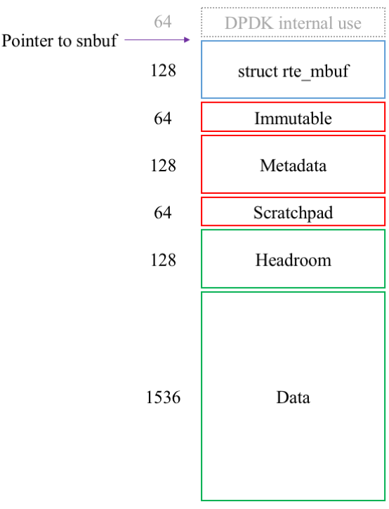
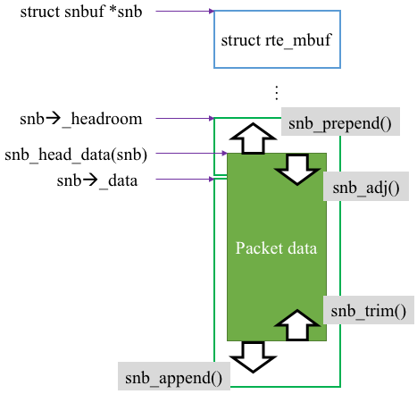

## Packet Buffer (struct snbuf)

In BESS, all packets are represented as `struct snbuf`, which is defined in `core/snbuf.h`. All per-packet data, such as static/dynamic metadata, and packet data (headers and payload) are stored in the packet buffer. 


### Per-socket packet pool

In NUMA systems, BESS allocates a pool of packet buffers for each NUMA socket/node. This is currently done with DPDK mempool, although it may change in the future. BESS requires 2GB of hugepages for each socket by default -- either two 1GB hugepages or 1,024 2MB hugepages. The number of allocated packet buffers is 512k per pool by default, but it may be smaller if DPDK cannot find a physically contiguous memory that is large enough for 512k packets.


### Layout

Each packet buffer is a (physically and virtually) contiguous memory space. Unlike other systems where metadata and actual packet data are stored in separate buffers (e.g., `struct sk_buff`), in BESS they are stored together in a single buffer. The following diagram shows the layout of `snbuf` and the size of each section. Note that all sections are 64B aligned.



* The first 64B is used by DPDK mempool. Since the pointer to `snbuf` points beyond this field, so you will not (and should not) see its data.
* rte_mbuf: This embedded struct contains DPDK packet metadata (see below).
* Immutable: This section has some read-only data for packets. All fields are stored when BESS starts up, and the values do not (and must not) change.
  * immutable.vaddr: the virtual address of this packet buffer (identical to `struct snbuf *`)
  * immutable.paddr: same as immutable.vaddr, except it is a physical memory address.
  * immutable.sid: NUMA socket (pool) ID in which the packet buffer was allocated
  * immutable.index: A sequence number of packet (numbered from 0 for each pool). The <sid, index> pair of every packet buffer will be unique in the system.
* Metadata: This section is reserved for dynamic metadata, which can be utilized to tag per-packet metadata information across modules.
* Scratchpad: You can use this scratchpad area to store some temporary per-packet metadata, instead of allocating a separate buffer. This small area is intended only for internal use within a module or a driver. 
  * You should *NOT* use the scratchpad to carry information *across* modules.
  * It is never zero-filled by BESS, so may contain some garbage data.
* Both headroom and data sections can be used to store actual packet data.
  * When you allocate a packet buffer or receive a packet from a port, the packet data will always start from the data section, leaving the headroom unused.
  * The headroom area is intended for adding tunneling headers at the beginning, without shifting the whole packet data.
  * Modules should call `snb_head_data()` (see below), to figure out where the packet data actually begins. 

The total size (including all overheads) of a packet buffer is 2,112 bytes. For the complete data structure of `struct snbuf`, see `core/snbuf.h`.

> NOTE: Dynamic metadata is not implemented yet.

 
### DPDK rte_mbuf compatibility

Essentially, `struct snbuf` is a simple wrapper of `struct rte_mbuf` (the packet buffer format used by DPDK). You can find the details of `rte_mbuf` [here](http://dpdk.org/doc/guides/prog_guide/mbuf_lib.html). 

**A valid `snbuf` is also a valid `rte_mbuf`** (but not *vice versa*). With that said, you can directly use any [DPDK functions](http://dpdk.org/doc/api/rte__mbuf_8h.html) that accept `rte_mbuf` by simply doing type casting from `snbuf`.  Once it is compiled there is no runtime overhead. For example, the following code will dump the contents of a snbuf:

```c
struct snbuf *snb;
...
rte_pktmbuf_dump(stdout, (struct rte_mbuf *)snb, 128);
```

Or instead of type casting, you can explicitly use the mbuf field:

```c
rte_pktmbuf_dump(stdout, &snb->mbuf, 128);
```

However, direct use of `rte_pktmbuf_*()` functions in your module code is not encouraged, since `struct snbuf` may not solely rely on DPDK in the future. It is possible for BESS to support other underlying packet buffer formats as well, such as Linux `sk_buff`; directly using DPDK functions will not work any longer. Use `snb_*()` functions whenever possible.


### Allocation and deallocation of packet buffers

You can allocate a packet buffer with `snb_alloc()`. By default, a packet will be obtained from the pool, whose NUMA node is the one that the current worker thread is running on. For deallocation, use `snb_free()`. These functions wrap `rte_pktmbuf_alloc()`/`rte_pktmbuf_free()`.

> NOTE: Do not directly use `rte_pktmbuf_alloc()`/`rte_pktmbuf_free()`, unless you know what you are doing.

When you need to (de)allocate multiple packet buffers, use the following **bulk** functions.

```c
int snb_alloc_bulk(snb_array_t snbs, int cnt, uint16_t len);
void snb_free_bulk(snb_array_t snbs, int cnt);
```

(`snb_array_t` is a typedef for an array of `struct snbuf *`, which is also defined in `core/snbuf.h`)

As they are highly optimized, these functions will be much faster than repeatedly calling `snb_alloc()`/`snb_free()`	 in a loop. If your processor supports AVX instructions (Sandy Bridge or newer), these functions can (de)allocate hundreds of millions of packet buffers per second.


### Accessing and manipulating packet data

You can access the packet data with `char *snb_head_data()` function. It returns a pointer to the starting address of packet data. Typically, the packet data will start with an Ethernet header, while some modules may have different assumptions.

There are two functions that returns the length of packet data as follows. **head** refers to the first data segment of the packet; the two functions will return the same value if the packet is not chained, which is the common case.

```c
int snb_head_len(struct snbuf *snb);
int snb_total_len(struct snbuf *snb);
```

To resize the packet (i.e., adding/removing headers or payload), there are four functions as follows. It is your responsobility to ensure that packet data does not spill over the headroom and data sections.

Functions       | Usage                         | Return value
:---            |:---                           |:---
`snb_prepend()` | add a new header              | the new data start address
`snb_adj()`     | remove an existing header     | the new data start address
`snb_append()`  | append payload                | the old data end address
`snb_trim()`    | remove payload from the end   | (none)



> NOTE: Just as in DPDK, packet chains (packet data is segmented across multiple packet buffers) and indirect buffers (packet data segment may point to another packet buffer) are also supported in BESS. However, since BESS does not provide wrapper functions yet, instead use `rte_pktmbuf_*()` functions for now.